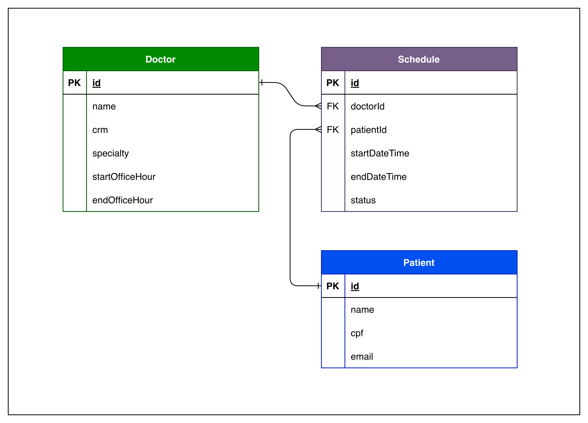

# Debug Doctors 🏥

API REST para gestão de agendamento de consultas médicas com validações robustas e testes automatizados.

## 📋 Objetivo

Desenvolver uma API REST para gestão de horários médicos, com foco em garantir a **integridade das agendas** através de testes unitários automatizados e entrega contínua via pipeline.

---

## 🏗️ Tecnologias

- **Java 25**
- **Spring Boot 4.0.3**
- **Maven**
- **JUnit** (testes unitários)
- **Lombok** (redução de boilerplate)

---

## 📦 Principais Entidades

### Médico
- Nome
- Especialidade
- CRM
- Horário de Início do Expediente
- Horário de Fim do Expediente

### Paciente
- Nome
- CPF
- E-mail

### Agendamento
- Médico (referência)
- Paciente (referência)
- Data/Hora de Início
- Data/Hora de Fim
- Status (Agendado, Cancelado, Realizado)

---

## 📊 Diagrama de Entidade-Relacionamento (DER)



---

## ⚙️ Regras de Negócio

As seguintes validações são **obrigatórias** e devem ser testadas:

| Regra | Descrição | Status |
|-------|-----------|--------|
| ⏰ **Conflito de Horário** | Um médico não pode ter dois agendamentos sobrepostos | Implementado |
| 📅 **Fora do Expediente** | Não permitir agendamentos antes do início ou após o fim da jornada do médico | Implementado |
| ⏳ **Antecedência Mínima** | Consultas só podem ser agendadas com pelo menos 30 minutos de antecedência | Implementado |
| ❌ **Regra de Cancelamento** | O cancelamento só é permitido se faltarem mais de 24h para a consulta | Implementado |
| ⏱️ **Duração Padrão** | Validar se a consulta tem o tempo mínimo/máximo permitido (ex: 30 min) | Implementado |

---

## 👥 Histórias de Usuário

As histórias de usuário que guiaram o desenvolvimento e suas respectivas coberturas de testes estão detalhadas abaixo:

---

### **US01 - Cadastro de Médicos**
* **Como** Gestor do Hospital, **eu quero** cadastrar médicos com suas especialidades, CRM e horários de expediente **para que** eles fiquem disponíveis para novos agendamentos.
* **Prioridade:** Alta
* **Status Final:** Entregue
* **Critérios de Aceitação:**
  * **Cenário 1: Cadastro realizado com sucesso**
    * **Given** que informei dados válidos (Nome, Especialidade, CRM, Shift Start, Shift End),
    * **When** eu solicitar o cadastro do médico,
    * **Then** o médico deve ser cadastrado com sucesso.
  * **Cenário 2: Cadastro rejeitado por CRM em branco**
    * **Given** que o CRM não foi informado ou está vazio,
    * **When** eu solicitar o cadastro do médico,
    * **Then** o sistema deve lançar uma exceção de argumento inválido.
  * **Cenário 3: Cadastro rejeitado por expediente inválido**
    * **Given** que o horário de início do expediente é posterior ao horário de término,
    * **When** eu solicitar o cadastro do médico,
    * **Then** o sistema deve lançar uma exceção de argumento inválido.
* **Rastreabilidade:** US01 -> Issue #1 / PR #1 -> [DoctorTest.java](file:///Users/schulzdimitrii/Documents/GitHub-Projects/debug-doctors/src/test/java/br/inatel/debug_doctors/domain/DoctorTest.java) (`shouldCreateDoctorSuccessfully`, `shouldValidateDoctorWithValidCrm`, `shouldThrowWhenDoctorHasInvalidShift`)

---

### **US02 - Cadastro de Pacientes**
* **Como** Gestor do Hospital, **eu quero** cadastrar pacientes com nome, e-mail e CPF **para que** seja possível vinculá-los a consultas.
* **Prioridade:** Alta
* **Status Final:** Entregue
* **Critérios de Aceitação:**
  * **Cenário 1: Cadastro realizado com sucesso**
    * **Given** que informei dados válidos (Nome, CPF com 14 caracteres e e-mail contendo "@"),
    * **When** eu solicitar o cadastro do paciente,
    * **Then** o paciente deve ser cadastrado com sucesso.
  * **Cenário 2: Cadastro rejeitado por e-mail inválido**
    * **Given** que o e-mail informado não contém o caractere "@",
    * **When** eu solicitar o cadastro do paciente,
    * **Then** o sistema deve lançar uma exceção de argumento inválido.
  * **Cenário 3: Cadastro rejeitado por CPF inválido**
    * **Given** que o CPF informado não contém exatamente 14 caracteres (incluindo pontuação),
    * **When** eu solicitar o cadastro do paciente,
    * **Then** o sistema deve lançar uma exceção de argumento inválido.
* **Rastreabilidade:** US02 -> Issue #2 / PR #2 -> [PatientTest.java](file:///Users/schulzdimitrii/Documents/GitHub-Projects/debug-doctors/src/test/java/br/inatel/debug_doctors/domain/PatientTest.java) (`shouldCreatePatientWithCorrectData`, `shouldValidatePatientWithValidData`)

---

### **US03 - Criação de Agendamentos**
* **Como** Atendente do Hospital, **eu quero** agendar uma consulta vinculando um paciente e um médico em uma data futura **para que** o horário seja reservado.
* **Prioridade:** Alta
* **Status Final:** Entregue
* **Critérios de Aceitação:**
  * **Cenário 1: Agendamento criado com sucesso**
    * **Given** que informei um paciente válido, um médico válido, e uma data/hora no futuro,
    * **When** eu solicitar o agendamento da consulta,
    * **Then** o agendamento deve ser criado com status não confirmado.
  * **Cenário 2: Impedir agendamento no passado**
    * **Given** que a data e hora informadas para o agendamento estão no passado,
    * **When** eu solicitar o agendamento da consulta,
    * **Then** o sistema deve lançar uma exceção de argumento inválido.
  * **Cenário 3: Impedir agendamento sem paciente ou sem médico**
    * **Given** que não informei o paciente ou o médico,
    * **When** eu solicitar o agendamento da consulta,
    * **Then** o sistema deve lançar uma exceção de argumento inválido.
* **Rastreabilidade:** US03 -> Issue #3 / PR #3 -> [ScheduleTest.java](file:///Users/schulzdimitrii/Documents/GitHub-Projects/debug-doctors/src/test/java/br/inatel/debug_doctors/domain/ScheduleTest.java) (`testNewSchedule`, `cannotAllowScheduleInThePast`, `cannotCreateScheduleWithoutPatient`, `cannotCreateScheduleWithoutDoctor`)

---

### **US04 - Bloqueio de Agendamentos Conflitantes**
* **Como** Atendente do Hospital, **eu quero** que o sistema impeça agendamentos sobrepostos para o mesmo médico **para que** não ocorram conflitos na agenda do médico.
* **Prioridade:** Alta
* **Status Final:** Entregue
* **Critérios de Aceitação:**
  * **Cenário 1: Bloqueio de agendamento sobreposto**
    * **Given** que o médico já possui um agendamento na data/hora desejada,
    * **When** eu solicitar um novo agendamento para este mesmo médico nesta mesma data/hora,
    * **Then** o sistema deve lançar uma exceção de conflito de horário.
* **Rastreabilidade:** US04 -> Issue #4 / PR #4 -> [ScheduleTest.java](file:///Users/schulzdimitrii/Documents/GitHub-Projects/debug-doctors/src/test/java/br/inatel/debug_doctors/domain/ScheduleTest.java) (`cannotAllowOverlappingSchedules`, `shouldThrowWhenConflictDetectedWithMockedExistingSchedule`)

---

### **US05 - Cancelamento de Consultas**
* **Como** Paciente ou Atendente, **eu quero** poder cancelar um agendamento informando um motivo **para que** o horário seja liberado na agenda.
* **Prioridade:** Média
* **Status Final:** Entregue
* **Critérios de Aceitação:**
  * **Cenário 1: Cancelamento com sucesso**
    * **Given** que o agendamento selecionado está ativo,
    * **When** eu solicitar o cancelamento e informar um motivo válido,
    * **Then** o agendamento deve ser marcado como cancelado e o motivo deve ser armazenado.
  * **Cenário 2: Impedir cancelamento duplo**
    * **Given** que o agendamento selecionado já se encontra cancelado,
    * **When** eu tentar cancelar novamente,
    * **Then** o sistema deve lançar uma exceção de estado inválido.
* **Rastreabilidade:** US05 -> Issue #5 / PR #5 -> [ScheduleTest.java](file:///Users/schulzdimitrii/Documents/GitHub-Projects/debug-doctors/src/test/java/br/inatel/debug_doctors/domain/ScheduleTest.java) (`shouldCancelScheduleSuccessfully`, `cannotCancelAlreadyCanceledSchedule`)


---

## 🚀 Como Executar

### Pré-requisitos
- Java 25+
- Maven 3.6+

### Clonar e Instalar

```bash
git clone https://github.com/seu-usuario/debug-doctors.git
cd debug-doctors
```

### Executar a Aplicação

```bash
./mvnw spring-boot:run
```

A aplicação estará disponível em: `http://localhost:3000`

### Executar Testes

```bash
./mvnw test
```

---

## 📝 Endpoints

A API fornece os seguintes endpoints:

### Médicos
- `GET /api/medicos` - Listar todos os médicos
- `POST /api/medicos` - Criar novo médico
- `GET /api/medicos/{id}` - Obter dados de um médico
- `PUT /api/medicos/{id}` - Atualizar dados de um médico
- `DELETE /api/medicos/{id}` - Remover um médico

### Pacientes
- `GET /api/pacientes` - Listar todos os pacientes
- `POST /api/pacientes` - Criar novo paciente
- `GET /api/pacientes/{id}` - Obter dados de um paciente
- `PUT /api/pacientes/{id}` - Atualizar dados de um paciente
- `DELETE /api/pacientes/{id}` - Remover um paciente

### Agendamentos
- `GET /api/agendamentos` - Listar todos os agendamentos
- `POST /api/agendamentos` - Criar novo agendamento (com validações)
- `GET /api/agendamentos/{id}` - Obter dados de um agendamento
- `PUT /api/agendamentos/{id}/cancelar` - Cancelar um agendamento
- `PUT /api/agendamentos/{id}/confirmar` - Confirmar realização

---

## 🧪 Estratégia de Testes

Cada regra de negócio e controlador possui testes automatizados específicos:

```
src/test/java/br/inatel/debug_doctors/
├── controller/
│   └── DoctorControllerTest.java
└── domain/
    ├── DoctorTest.java
    ├── PatientTest.java
    ├── PatientTestMock.java
    ├── ScheduleTest.java
    └── ManualMockTest.java
```

---

## 📊 Status do Projeto

- [x] Setup inicial do projeto
- [x] Criar entidades (Médico, Paciente, Agendamento)
- [x] Implementar validações de negócio
- [x] Criar testes unitários
- [x] Implementar controllers REST
- [ ] Documentação API (Swagger/OpenAPI)
- [x] Pipeline CI/CD
- [ ] Deploy em produção

---

## 📝 Notas de Desenvolvimento

- Usar **Lombok** para reduzir boilerplate de getters/setters
- Implementar validações como **serviços separados** ou **validators**
- Usar **try-catch** com `RuntimeException` ou `IllegalArgumentException` para violações de regra
- Manter **100% de cobertura de testes** para todas as regras de negócio
- Documentar cada regra com exemplos de entrada/saída

---

**Desenvolvido por alunos do curso de Engenharia de Software e Computação do INATEL - 2026**
